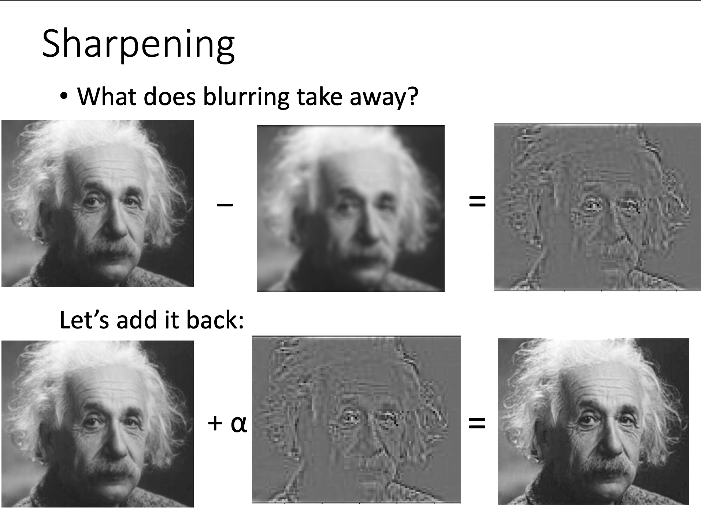

# Image Filtering

In this assignment, we'll learn about how to implement some basic image filters, and how to use them for some interesting applications, such as sharpening the quality of an image.

## Objectives
* Become familiar with Pillow, NumPy, Matplotlib.
* Begin working in a different paradigm of Python for more mathematically-grounded programming
* Become familiar with packaging separate sets of functionality for better organization of code

## Git
Before you start the assignment, please make sure that you have

1. Accepted the assignment invitation (ask me to get this URL)
2. Set up the assignment repo for yourself


## Assignment
Please implement all functions in the `data`, `processing`, and `visualization` subpackages, and make sure that all corresponding tests pass. Tests can be found in any file in this repository with the prefix `tests_`. To run all tests with `pytest` run `pytest -v`.

For implementing the functionality, read the documentation to understand what the function should do, 
and how to go about implementing the functionality. There are some comments providing hints/guidelines for specific parts of each function. It might also be useful to see what the tests 
are testing for, to see what expected functionality looks like.

The main executable here is `main.py`. This takes in a couple arguments - in particular, we are computing various filters on whatever image is specified as an argument. There are 5 images included in the `images` subdirectory:

* `blurry_skyline.jpeg`
* `blurry_street.jpg`
* `face.jpg`
* `starry_night.jpg`
* `tower.jpg`

You will be implementing the mean filter, Gaussian (normal) filter, and sharpening transformation. As such, the arguments to the `main.py` executable are as follows:

1. Path to the image that you want to transform, e.g. `./images/face.jpg`. Note that this can be any image on your computer, you just have to specify the path to that image.
2. The transformation you want to apply, e.g. `mean`, `gaussian`, or `sharpen`.
3. The output path, where you want to store your transformed image, e.g. `./result.jpg`.
4. The size of the filter/kernel, e.g. (3, 3). This is an optional argument, but if specified, can be specified as either an integer or a tuple of integers. If it's an integer, then the filter is assumed to be square, and if it as a tuple of integers, that fully specifies the shape of the kernel. For this assignment, we'll enforce that the dimensions of the kernel are odd.
5. If the transformation specified is `gaussian`, then you can specify a value for the `sigma` parameter. By default, it will be 1 if not specified.
6. If the transformation specified is `sharpen`, then you can specify a value for the `alpha` parameter, as shown in the image below. By default, it will be set to 0.1 if not specified.


The syntax for passing in these arguments is as follows:
```
python main.py --image ./images/face.jpg --transformation gaussian --output ./result.jpg --size (3, 5) --sigma 1.5
```
or, for sharpening:
```
python main.py --image ./images/face.jpg --transformation sharpen --output ./result.jpg --size (5, 3) --alpha 0.2
```
